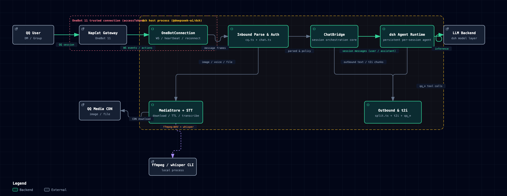

# dsh-onebot

> **English | [中文](README.md)**

A QQ channel for DeepSeek Harness. 给 DeepSeek Harness 加上 QQ 通道。

This plugin turns dsh into a QQ bot (**OneBot 11 protocol**, compatible with NapCat / Lagrange / LLOneBot / go-cqhttp).
Like [dsh-vision](https://github.com/dsh-external/dsh-vision), it ships as an external plugin: **zero Python, pure
TypeScript, a native Cordis plugin** mounted into the dsh host process, with no core code changes.

```
User(QQ) ←→ NapCat ←→ dsh-onebot plugin ←→ dsh Agent (one per chat)
                        ├─ Reverse WS server / forward WS client (auto-reconnect)
                        ├─ Inbound: CQ parsing, image download, speech-to-text (STT), reply/forward expansion
                        └─ Outbound: single/t2i-card send, Markdown stripping, [[qq_forward]], image/voice/video/file tools
```

## Architecture



> Interactive version (dark/light theme toggle + guided views): [docs/dsh-onebot-architecture.html](docs/dsh-onebot-architecture.html); vector version: [docs/dsh-onebot-architecture-en.svg](docs/dsh-onebot-architecture-en.svg).

## Features

| Category | Capability |
|---|---|
| Connection | Reverse WS (NapCat ws-reverse dials in, default port 8643) or forward WS (plugin dials out, default `ws://127.0.0.1:3001`); auto-reconnect with backoff (2s → 60s) |
| Inbound | Private/group chats; segment-array-first parsing (CQ string fallback), CQ unescaping, @/reply trigger detection (fail-closed; replies count only when replying to the bot itself); images resolved from 4 sources (url/base64/file/hash) with auto-shrink (long edge ≤ `inboundImageMaxPx`, GIFs untouched); files received via dual channel (CDN direct link `get_private_file_url` + `get_file` base64/url fallback); face id→emoji/card/poke segment types; quoted messages auto-fetched via `get_msg`; merged forwards auto-expanded via `get_forward_msg` |
| Voice | ffmpeg to 16 kHz WAV + whisper transcription (openai-whisper / whisper.cpp / custom command); **non-blocking**: the voice message enters the turn as a `[语音]` placeholder right away, and the transcript follows as a `（语音转写：…）` supplement when done (default timeout 60s); failure keeps the `[语音]` placeholder |
| Text image | t2i card renderer (@napi-rs/canvas): headings/bold/italic/strikethrough/quotes/lists/code blocks/tables/inline code pills/color emoji/CJK punctuation rules; same numbers as the Hermes original (800px/26px/rules/right edge 790) |
| Outbound | Body length ≤ `textImageThreshold` (default 150) is sent as one message; **over the threshold renders a t2i text-image card** (AstrBot style: headings/quotes/lists/tables/code blocks/color emoji; render failure, a PNG over `outboundImageMaxBytes`, or `<=0` (card path disabled) falls back to a single plain-text message); Markdown stripped to plain QQ text; `[[qq_forward]]` merged-forward cards (group/private); **live interim messages** (`interimMessages`: each interim text is sent immediately; each is auto-recalled alone after `interimRecallMs` (default 90s); at turn end the whole turn's interims render into one **t2i summary card**, the still-on-screen originals are recalled, then the final reply is sent — no turn-end merged forwarding, avoiding unrecallable >2min originals and duplicate cards on long turns; `interimRecall: false` degrades to send-only: no summary card, no recall); **host plan-book/question-card auto-relay** (when the model calls exit_plan_mode / ask_user_question, the full plan text / question options are sent to QQ), typing indicator (`set_input_status`, private chats only) |
| Commands | Slash commands (admin only): `/new` fresh session (context cleared, old session kept on disk), `/stop` stop the current generation, `/model` view/switch the current session's model (`--default` changes the deployment default; the bare form renders a two-level numbered list — reply with a number to pick a provider, then a number to pick the model), `/workspace` view/switch workspace (bare form renders a numbered list; reply with a number to switch), `/preset` view/switch agent presets (session rebuilt, recorded in the new session's header; bare form numbered), `/status` session panorama: chat/session/preset/model/cwd/outbound mode/agent status, `/retry` rerun the last user message (retry after a failed turn; refused while a generation is in progress), `/id` chat/session/cwd only (for troubleshooting), `/ver` plugin version + git commit, `/ocr` OCR the latest inbound image of this session (NapCat ocr_image), `/mode` switch this session's outbound mode (per-chat override, persisted across restarts), `/plan` host plan mode (`/plan off` exits directly with no Web approval card), `/goal` record/update the session goal (auto-attached as a reminder each turn, persisted across restarts), `/help` help; unknown slash commands are intercepted by default with close-match suggestions (`unknownCommand: passthrough` restores the fall-through to the model) |
| Tools | `qq_send_image` (≤9 images, path or URL), `qq_send_voice`, `qq_send_video`, `qq_send_file`, `qq_send_forward`, `qq_napcat_api` (14 allowlisted actions), `qq_group_history` (guarded file editing `code_safe_edit`/`code_safe_rollback`/`code_list_backups` moved to the standalone plugin **dsh-safe-edit** — see README.md → 安全编辑) |
| Permissions | Admin allowlist (`ONEBOT_ALLOWED_USERS`), dm/group policies (open/allowlist/disabled), group @-mention gating, restricted users soft limit (`[受限用户:仅问答]`), outbound sensitive-content auditing |
| Sessions | One persistent Agent per QQ chat (stable derived session id), auto-resumed after restart; mounted into presets/workspaces via `agentPreset`/`workspacePath`; mapping flushed to disk at the end of every turn |
| Ops | Hot reload (edit patch config/touch → takes effect, no dsh restart); temp media TTL cleanup |
| Prompt | Injects QQ platform notes automatically (plain-text output, `[图片]`/`[语音]` placeholders for incoming images/voice, tool & command guidance, host interaction cards banned); injected into **each QQ chat agent's own scope**, invisible to Web sessions |

## Compatibility

| Item | Requirement |
|---|---|
| dsh | ≥ 0.1.5-rc.1 (`engines.dsh`; all @deepseek-ai/* peer deps ≥0.1.5-rc.1, JsonValue provided by dsh-util-values) |
| Node.js | ≥ 22 |
| OneBot 11 impl | NapCat / Lagrange / LLOneBot / go-cqhttp (reverse or forward WebSocket) |
| Optional deps | Voice transcription needs ffmpeg + whisper CLI; t2i text images need Noto CJK fonts on Linux |

Last verified: 2026-09-12 (M4 interaction & persistence: unknown-command interception / serial selection / workspace persistence — 306/306 vitest green, build clean; M0 security semantics unchanged: reverse mode refuses an empty accessToken and defaults to 127.0.0.1, see the BREAKING note under the config table).

## Installation

**Prerequisites**: dsh (≥0.1.5-rc.1) on PATH; NapCat or another OneBot 11 implementation running.

```sh
git clone <repo> ~/dsh-plugins/dsh-onebot
cd ~/dsh-plugins/dsh-onebot
npm install --include=dev
./scripts/build.sh          # link host @deepseek-ai packages + tsc src/ → lib/
```

Mount it in `~/.dsh/config.yaml` (create it if missing):

```yaml
- insert:
    - id: dsh-onebot
      name: '$HOME/dsh-plugins/dsh-onebot/lib/index.js'
      config:
        mode: reverse        # reverse = NapCat dials in; forward = plugin dials out
        port: 8643
        # accessToken: 'token-matching-NapCat'  # required: reverse mode refuses to start with an empty token (M0 hardening)
        # botQQ: ''          # leave empty to learn automatically from meta events
        adminUsers: ['<your-QQ-number>']   # required: at least one admin, otherwise private chats & slash commands are unavailable
```

> ⚠️ **You must configure at least one admin on first setup** (`adminUsers` or the `ONEBOT_ALLOWED_USERS` env var):
> `dmPolicy: open` (default) only allows admins to DM, and slash commands are admin-only too; with no admin,
> nobody can talk to the bot.
> For development you can temporarily set `allowAllUsers: true` (or `ONEBOT_ALLOW_ALL_USERS=true`) to allow everyone.

Restart dsh (`dsh web` or however you start it); the log line `[dsh-onebot] mounted` means it loaded.

**NapCat side (required, pick one of two modes)**:

- **reverse mode (NapCat dials into dsh, recommended)**: in NapCat's network settings add a **WebSocket client**,
  set "report URL" to dsh's WS address `ws://<dsh-host-ip>:<port>/ws` (e.g. `ws://192.168.1.100:8643/ws`),
  and set "token" to the same value as the plugin's `accessToken`; when dsh and NapCat are on different machines
  `127.0.0.1` won't work.
- **forward mode (dsh dials out to NapCat)**: enable the **WebSocket server** in NapCat's network settings
  (listens on `0.0.0.0:3001` by default), set the plugin's `url` to `ws://<napcat-host-ip>:3001`
  (`ws://127.0.0.1:3001` works on the same machine), tokens must match on both sides.

Tokens must match on both sides; for the message report format, choose **"array"** (the plugin parses segment
arrays first; CQ strings are only a fallback). After configuring, restart dsh. `[dsh-onebot] mounted` in the log
plus a successful NapCat connection means you're ready.

**Deployment requirements**: NapCat must be on a LAN **reachable from dsh** (same subnet / routable).
The WS connection, image downloads and file resolution all depend on this network path; when NapCat and dsh are
not on the same machine, enable the **"file-to-URL" switch** on the NapCat side so `get_file` returns a downloadable
http(s) url (otherwise it returns a container-local path the plugin cannot access).

## Configuration

The full schema lives in the `Config` of [src/index.ts](src/index.ts) (schemastery-validated, every key has a
default). Common options:

| Key | Default | Description |
|---|---|---|
| `mode` | `reverse` | `reverse`/`forward` |
| `host` / `port` | `127.0.0.1` / `8643` | reverse listen address; for cross-machine deployment (NapCat dialing in from another machine), explicitly set this to `0.0.0.0` |
| `url` | `ws://127.0.0.1:3001` | forward target |
| `reconnectMaxAttempts` | `100` | reconnect give-up limit: auto-reconnect stops after this many consecutive failures (the log includes the limit and recovery guidance); `0` = unlimited retries (backoff capped at 60s) |
| `accessToken` | empty | OneBot token; **required in reverse mode** — the plugin refuses to start when left empty (fail-closed); may stay empty in forward mode |
| `botQQ` | empty | bot QQ (empty = auto-learned) |
| `ignoreSelf` | `true` | Ignore messages sent by the bot itself (prevents self-loops) |
| `requireMention` | `true` | groups only respond when @-mentioned or replying to the bot's own messages (replies to other members don't trigger; when the replied-to message can't be determined, it falls back to counting as mentioned, fail-open) |
| `rateLimitPerMinute` | `30` | per-chat cap on ordinary messages per minute (60s sliding window): over-limit messages are skipped with a rate-limit notice (at most one per window); commands are exempt; `0` disables |
| `unknownCommand` | `intercept` | unknown slash-command handling: `intercept` (default) consumes the message and suggests close matches (prefix matches first, edit-distance ≤2 fallback only for inputs of length ≥4, at most 3 candidates; with no match it points to `/help` or re-sending without the leading `/`); `passthrough` restores the old fall-through to the model. Text not starting with a `/word` token (e.g. a path like `/tmp/x`) is unaffected |
| `dmPolicy` | `open` | DM policy: `open`(admins only)/`allowlist`/`disabled` |
| `groupPolicy` | `open` | group policy: `open`(everyone)/`allowlist`/`disabled` |
| `restrictedMemberPrefix` | `true` | Prefix non-admin group messages with `[受限用户:仅问答]` (soft restriction) |
| `adminUsers` | `[]` | admin QQ numbers; or the `ONEBOT_ALLOWED_USERS` env var. **At least one is required**, otherwise DMs (`dmPolicy=open`) and slash commands are unavailable to everyone |
| `allowFrom` / `groupAllowFrom` | `[]` | allowlisted users/groups |
| `interimMessages` | `true` | send interim text between tool calls immediately; `false` sends only the final reply |
| `interimRecall` | `true` | interim recall + turn-end summary card switch; `false` = send-only (degraded: no summary card, no recall) |
| `sendErrorNotice` | `true` | Send a ⚠️ error notice to the user when a turn fails |
| `sensitivePatterns` | `[]` | Outbound sensitive-content audit regexes (built-in `rm -rf`/shutdown/db-wipe/secret patterns; leave empty to use the built-in defaults) |
| `sttEnabled` | `true` | voice transcription (needs ffmpeg + whisper CLI) |
| `sttEngine` | `auto` | STT engine: `auto` (auto-detects whisper-cli/whisper/mlx_whisper)/`openai`/`whisper-cpp`/`custom` |
| `sttModel` | `small` | whisper model |
| `sttCommand` | empty | Program name/path for the `custom` engine |
| `sttArgs` | `[]` | Argument templates for the `custom` engine; `{file}` and `{out}` are substituted |
| `sttTimeoutMs` | `60000` | voice transcription timeout in ms (60s default since v0.4.0, previously 300s): on timeout the `[语音]` placeholder is kept; `<=0` falls back to the built-in 60s |
| `textImageThreshold` | `150` | t2i card threshold: body length ≤ this is sent as one message; > this renders a text-image card. Render failure, a PNG over `outboundImageMaxBytes`, or `<=0` (card path disabled) falls back to a single plain-text message |
| `cardFooter` | `dsh` | card footer brand ("Powered by <brand>") |
| `fontFiles` / `fontFamilies` | `[]` | t2i font file/family overrides (Linux deployments: install Noto CJK, see below) |
| `mediaDir` | `<dsh-home>/media/onebot` | inbound media / mapping file directory |
| `tempTtlHours` | `6` | Retention for inbound temporary media files (hours), auto-cleaned on expiry |
| `inboundImageMaxPx` | `2048` | inbound image long-edge limit (px): larger images are proportionally shrunk before reaching the vision model (transparent PNGs preserved, GIFs untouched); `<=0` disables (old name `imageMaxSize` deprecated, still honored this release) |
| `outboundImageMaxBytes` | `8388608` | outbound image size cap (bytes): an oversized t2i summary card falls back to plain text (old name `maxImageBytes` deprecated, still honored this release) |
| `maxVoiceBytes` | `15728640` | Outbound voice size cap (bytes) |
| `maxFileBytes` | `20971520` | Outbound video/file size cap (bytes) |
| `inboundFileMaxBytes` | `20971520` | inbound QQ file size cap (bytes): oversized file segments are rejected with a notice (old name `maxInboundFileBytes` deprecated, still honored this release) |
| `allowPrivateHosts` | `false` | allow downloads from private/loopback addresses (skips only the private-network check; the protocol allowlist and size limits still apply); enable only in trusted setups such as a local reverse proxy |
| `agentPreset` | empty | agent preset for sessions (empty = default) |
| `workspacePath` | empty | workspace for sessions (empty = host process cwd; when unconfigured the plugin warns once at startup recommending an explicit value — the host exposes no programmable default-workspace query). The per-chat `/workspace` override is persisted to the mapping file and survives restarts |
| `chatIdleEvictDays` | `7` | idle-session eviction (days): when a chat has had no activity for longer than this, its in-memory agent is cleaned up before the next inbound message is processed (the session is flushed to disk first and the mapping is kept, so a later message from the same chat resumes the original session); `0` = disabled |

> ⚠️ **BREAKING (M0 security hardening)**: in reverse mode an empty `accessToken` refuses to start (fail-closed); the `host` default changed from `0.0.0.0` to `127.0.0.1` (loopback only) — cross-machine deployments must explicitly configure `host: 0.0.0.0`.

Env vars: `ONEBOT_ALLOWED_USERS` (comma-separated admins), `ONEBOT_ALLOW_ALL_USERS=true` (development).

## Session workspace selection

Each QQ session picks its working directory at creation time, in this order (written into the session meta and
frozen for the session's lifetime):

1. The chat's `/workspace` override (per-chat, survives `/new` resets)
2. The configured `workspacePath`
3. The host process cwd (`process.cwd()`)

`/workspace <dir>` switches directories (realpath + directory check): it records the override and retires the
current agent, so the next message rebuilds the session under the new directory. The old session stays on disk.
The bare `/workspace` form renders a numbered list (the current directory is marked); reply with
`/workspace <number>` to switch without retyping the path; `/workspace list` lists all workspace records.

The per-chat `/workspace` override is persisted to the mapping file (chat-sessions.json, additive format that
stays compatible with older files): it survives restarts and failed session resumes, and a `/new` keeps it too —
as long as the chat uses a non-default directory, `/workspace` and new sessions keep using it after a restart.

Serial-number replies (`/workspace 2`, `/model 3`, `/preset 1`) resolve against a snapshot of the list the command
just printed and stay valid for 5 minutes (an expired snapshot asks you to list again); a purely numeric argument is
read as an index only while such a list is live, otherwise the original parameter semantics apply. Unknown slash
commands are intercepted by default with close-match suggestions — `unknownCommand: passthrough` passes them to
the model instead.
Sessions attach to GUI workspaces as follows: a new workspace is auto-created only when the session cwd equals
the configured `workspacePath` (or the host cwd when unset); legacy sessions carrying a foreign cwd are attached
only when a workspace already owns that path, never auto-created.

## dm / group access policies (pick on first setup)

Private (`dmPolicy`) and group (`groupPolicy`) chats each have three options:

| Option | dmPolicy (private) | groupPolicy (group) |
|---|---|---|
| `open` | **Admins only** can DM (`adminUsers`/`ONEBOT_ALLOWED_USERS`; with `allowAllUsers: true` everyone can) | **All groups** can chat (messages gated by `requireMention`: @ or reply-to-bot required; group members get the `[受限用户:仅问答]` soft limit) |
| `allowlist` | Only the **`allowFrom`** QQ numbers can DM (admin not required) | Only the **`groupAllowFrom`** groups can chat |
| `disabled` | All DMs rejected | All group chats rejected |

**Recommended setups**:
- Just for yourself → `dmPolicy: open` + configure `adminUsers` (only you can DM);
- A few friends → `dmPolicy: allowlist` + `allowFrom: ['QQ1','QQ2']`;
- Group-only bot → `groupPolicy: open` (with the default `requireMention: true`, members must @ the bot);
- Only specific groups → `groupPolicy: allowlist` + `groupAllowFrom`.

## t2i font dependencies

Text-image cards need three font families (CJK / monospace / color emoji). The plugin registers them
automatically from the system and fixed paths at startup; missing glyphs render as tofu blocks.

- **macOS**: zero install. Uses system Hiragino Sans GB / Songti SC, Menlo and Apple Color Emoji automatically.
- **Linux** (Debian/Ubuntu, one command):

  ```sh
  sudo apt install fonts-noto-cjk fonts-dejavu-core fonts-noto-color-emoji
  ```

  | Package | Provides (auto-registered path) | Used for |
  |---|---|---|
  | `fonts-noto-cjk` | `/usr/share/fonts/opentype/noto/NotoSansCJK-Regular.ttc` | CJK body/headings (SC face auto-extracted from the ttc, JP/Mono fallback) |
  | `fonts-dejavu-core` | `/usr/share/fonts/truetype/dejavu/DejaVuSansMono.ttf` | code blocks / inline code monospace |
  | `fonts-noto-color-emoji` | `/usr/share/fonts/truetype/noto/NotoColorEmoji.ttf` | color emoji |
  | optional `fonts-wqy-zenhei` / `fonts-wqy-microhei` | `/usr/share/fonts/truetype/wqy/*.ttc` | CJK fallback (when Noto is missing) |
  | optional `fonts-unifont` | `/usr/share/fonts/opentype/unifont/*.otf` | last-resort fallback |

- **Custom**: `fontFiles` adds extra font files (restart to apply); `fontFamilies` prioritizes family names.
  The renderer does an ink self-check: families missing glyphs are dropped and fall back automatically,
  so you never get a silent tofu card.

## Permissions & data

- **Network**: opens a WebSocket to the OneBot 11 gateway (reverse listen or forward dial-out); inbound
  images/files are downloaded from the QQ CDN.
- **Files**: inbound media and chat mappings are written to `<dsh-home>/media/onebot/` (`mediaDir`,
  expired files cleaned after 6 hours); session data is persisted by the dsh host.
- **System calls**: voice transcription invokes local ffmpeg and whisper CLI (disable with `sttEnabled: false`).
- **Sensitive info**: `accessToken` and the admin allowlist live in the dsh config, never in logs; outbound
  content passes a sensitive-information audit.
- **No telemetry**: nothing is collected; no third-party services are called besides your configured OneBot
  gateway and the image CDN.

## Platform notes injected into the model

- QQ does not render Markdown → output plain text (numbered/dashed lists, inline backticks).
- Send images/files/voice/video with the `qq_send_*` tools; merged forwards with `qq_send_forward`.
- Incoming images/voice/video are annotated in the text as `[图片]`/`[语音]`/`[视频]` placeholders (paths never enter the text); when no vision tool is available, say so honestly.
- Group messages carry a `[HH:MM nickname(QQ)]` prefix; restricted-user messages carry a `[受限用户:仅问答]`
  prefix (answer only, no file/terminal/config operations).
- This channel is QQ and the host has no Web interaction cards: do not call `ask_user_question` / `exit_plan_mode` (confirmation cards are Web-only and would stall the conversation); ask and confirm in plain text; in host plan mode, output the plan as plain text and point to `/plan off` to exit.
- Slash commands are intercepted by the plugin (14 of them, admin only, see `/help`); unknown slash commands are intercepted by default with close-match suggestions, and `unknownCommand: passthrough` passes them to the model; text that does not start with a `/word` token (e.g. a path) still goes to the model normally.
- Edit host files with the built-in read/edit (line-level hash anchors, dsh-better-edit auto-undo); never overwrite whole files with write (it clears the undo history).

## Uninstall

1. Remove the dsh-onebot insert entry from `~/.dsh/profiles/<profile>/cordis.patch.yml`;
2. Restart dsh; `[dsh-onebot] mounted` gone from the log means it's unloaded;
3. Optional: delete the plugin directory and leftover media under `<dsh-home>/media/onebot/`.

## Development

```sh
./scripts/build.sh                 # compile src/ → lib/
./node_modules/.bin/vitest run     # 306 tests: unit + real WS peer + full pipeline
```

Lessons ported from the source DEVLOG:

- **CQ unescaping**: NapCat escapes `&` in URLs to `&amp;`; unescape before downloading (the root cause of CDN 403s).
- **Fail-closed @ detection**: when the bot's QQ is unknown, group messages are treated as un-mentioned and never
  auto-replied.
- **Fail pending actions on disconnect**: reject all in-flight actions immediately on WS close to avoid 10-30 s
  stalls and leaks.
- **Dedupe reconnects**: only one reconnect task per concurrent disconnect, preventing dual WS connections.
- **int(target) fallback**: chat_id parsing runs inside try/catch so a bad target can't crash the host.
- **Temp media 6h cleanup**: write-only-without-delete would pile up forever.
- **t2i iterates by code point**: JS string indexing splits emoji surrogate pairs (the high surrogate gets
  classified as CJK → rendered as a black glyph); drawing/measuring must use `Array.from`/for...of.
- **t2i measure = draw**: line breaks/column widths all go through `segWidth` (pill/bold/italic extra width),
  with pixel-level right-edge verification ≤790 (non-white test `not(r>245&&g>245&&b>245)`).

## Troubleshooting

| Symptom | Cause & fix |
|---|---|
| Group chat not responding | With `requireMention: true`, @ or reply-to-the-bot is required; @ detection is fail-closed; make sure botQQ was learned from meta events or configured explicitly |
| Image download 403 | NapCat escapes `&` in URLs to `&amp;` (parsing unescapes automatically); if it still fails, check the media download line in the log |
| File receive fails | NapCat on a different machine needs the "file-to-URL" switch on, otherwise `get_file` returns an unreachable container path; confirm dsh ↔ NapCat network connectivity |
| Tofu CJK in text images | Linux without CJK fonts: `apt install fonts-noto-cjk`, and point `fontFiles` at an SC font file |
| Crash loop / tool registration conflict | The same plugin file inserted twice (double instance); check the patch has no duplicate entries |
| Voice never gets a transcript (stays `[语音]`) | ffmpeg or whisper unavailable, or transcription timed out: install and restart, raise `sttTimeoutMs`, or set `sttEnabled: false` |
| Where are the logs | dsh host logs; historical root causes & fixes in [DEVLOG.md](DEVLOG.md) |

## Development record

Full timeline / root causes / fixes: [DEVLOG.md](DEVLOG.md) (ported from the Hermes onebot plugin's DEVLOG convention).

## License

BSD-3-Clause
