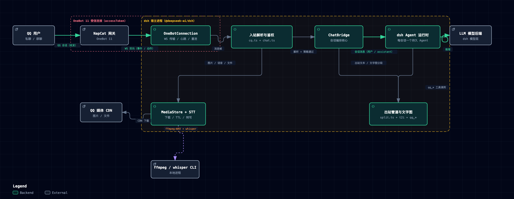

# dsh-onebot

> **[English](README.en.md) | 中文**

给 DeepSeek Harness 加上 QQ 通道。A QQ channel for dsh.

本插件把 dsh 变成一个 QQ 机器人（**OneBot 11 协议**，兼容 NapCat / Lagrange / LLOneBot / go-cqhttp），
与 [dsh-vision](https://github.com/dsh-external/dsh-vision) 同款的外部插件形态：**零 Python、纯 TS、
原生 Cordis 插件**，挂载进 dsh 宿主进程，不改任何核心代码。

```
用户(QQ) ←→ NapCat ←→ dsh-onebot 插件 ←→ dsh Agent（每个会话一个）
                        ├─ 反向 WS 服务器 / 正向 WS 客户端（自动重连）
                        ├─ 入站：CQ 解析、图片下载、语音转写(STT)、引用/合并转发展开
                        └─ 出站：分段发送、Markdown 剥离、[[qq_forward]]、图片/语音/视频/文件工具
```

## 架构



> 可交互版本（暗/亮主题切换 + 引导视图）：[docs/dsh-onebot-architecture.html](docs/dsh-onebot-architecture.html)；矢量版：[docs/dsh-onebot-architecture.svg](docs/dsh-onebot-architecture.svg)。

## 功能

| 类别 | 能力 |
|---|---|
| 连接 | 反向 WS（NapCat ws-reverse 拨入，默认端口 8643）或正向 WS（拨出，默认 ws://127.0.0.1:3001）；断线自动重连（2s→60s 退避） |
| 入站 | 私聊/群聊、段数组优先解析（CQ 字符串回退）、CQ 反转义、@/回复触发检测（fail-closed）、图片四路解析（url/base64/file/hash）、大图自动压缩（长边 ≤`imageMaxSize`，GIF 不压）、文件段双通道接收（CDN 直链 get_private_file_url + get_file base64/url 回退）、表情 id→emoji/卡片/戳一戳段类型、引用消息自动取原文（get_msg）、合并转发自动展开（get_forward_msg） |
| 语音 | ffmpeg 转 16kHz WAV + whisper 转写（openai-whisper / whisper.cpp / 自定义命令），失败降级 [语音] 占位 |
| 文字图 | t2i 卡片渲染器（@napi-rs/canvas）：标题/粗斜体/删除线/引用/列表/代码块/表格/行内 code 胶囊/彩色 emoji/中文标点禁则；与 Hermes 原版同款数值（800px/26px/禁则集合/右缘 790） |
| 出站 | 长消息按句号分段（默认 ≤100 字/条）、**>150 字渲染 t2i 文字图卡片**（AstrBot 风格：标题/引用/列表/表格/代码块/彩色 emoji，渲染失败自动回退分段）、Markdown 剥离为 QQ 纯文本、[[qq_forward]] 合并转发（群/私聊）、**实时中间消息**（interimMessages：每条中间文本立即发出、实时可见；各自在 `interimRecallMs`（默认 90s）后自动单独撤回；回合结束时先把整轮中间消息渲染成一张 **t2i 小结卡**、立即撤回仍在屏幕上的原文、再发送最终回复——不用回合末合并转发，避免长回合「原文超 2 分钟撤不回+转发卡重复」）、**宿主「计划书/提问卡」自动中继**（模型调用 exit_plan_mode / ask_user_question 时把计划全文/问题选项发到 QQ）、正在输入提示（set_input_status，仅私聊） |
| 命令 | 斜杠命令（仅管理员）：`/new` 开新会话、`/stop` 停止生成、`/model` 查看/切换模型、`/workspace` 查看/切换工作区、`/preset` 查看/切换 agent 预设、`/status` 会话全景、`/retry` 重跑上一条、`/id` 会话标识、`/ver` 版本、`/ocr` 识别最近图片、`/mode` 切换出站模式、`/plan` 计划模式、`/goal` 目标记录、`/help` 帮助 |
| 工具 | `qq_send_image`（≤9 张，路径或 URL）、`qq_send_voice`、`qq_send_video`、`qq_send_file`、`qq_send_forward`、`qq_napcat_api`（14 个白名单 action）、`qq_group_history`（文件编辑工具 `code_safe_edit` 等已拆至独立插件 dsh-safe-edit，见下文「安全编辑」） |
| 权限 | 管理员白名单（`ONEBOT_ALLOWED_USERS`）、dm/group 策略（open/allowlist/disabled）、群聊 @提及 gating、受限用户 [受限用户:仅问答] 软限制、出站敏感内容审计 |
| 会话 | 每个 QQ 会话一个持久 Agent（session id 稳定派生），重启后自动 resume；按 `agentPreset`/`workspacePath` 挂载到 preset 与工作区；每轮结束 flush 落盘 |
| 运维 | 热加载（改 patch 配置/touch 即生效，无需重启 dsh）；临时媒体 TTL 过期清理 |
| 提示词 | 自动注入 QQ 平台说明（纯文本输出、图片/语音标注 `[图片]`/`[语音]` 占位、工具与命令指引、禁宿主交互卡）；按**每个 QQ 会话 agent 自身作用域**注入，Web 会话不可见 |

## 兼容性

| 项 | 要求 |
|---|---|
| dsh | ≥ 0.1.0-rc.6（`engines.dsh`；@deepseek-ai/* 均为 peer 依赖 0.1.0-rc.6） |
| Node.js | ≥ 22 |
| OneBot 11 实现 | NapCat / Lagrange / LLOneBot / go-cqhttp（reverse 或 forward WebSocket） |
| 可选依赖 | 语音转写需 ffmpeg + whisper CLI；t2i 文字图在 Linux 需 Noto CJK 字体 |

最后验证：2026-08-16（99/99 vitest 全绿，dsh web 实测 QQ 私聊/群聊收发、文字图卡片、长文本分段、loop 中间消息即时发送+合并转发+撤回、语音转写、入站大图压缩）。

## 安装

**前置**：dsh（≥0.1.0-rc.6）在 PATH 上；NapCat 或其他 OneBot 11 实现已运行。

```sh
git clone <repo> ~/dsh-plugins/dsh-onebot
cd ~/dsh-plugins/dsh-onebot
npm install --include=dev
./scripts/build.sh          # 链接宿主 @deepseek-ai 包 + tsc 编译 src/ → lib/
```

挂载到 ~/.dsh/config.yaml（没有就新建）：

```yaml
- insert:
    - id: dsh-onebot
      name: '$HOME/dsh-plugins/dsh-onebot/lib/index.js'
      config:
        mode: reverse        # reverse = NapCat 拨入；forward = 插件拨出
        port: 8643
        # accessToken: ''    # 与 NapCat 配置一致
        # botQQ: ''          # 留空自动从 meta 事件学习
        adminUsers: ['你的QQ号']   # 必配：至少一个管理员，否则私聊/斜杠命令不可用
```

> ⚠️ **首次配置必须设置至少一个管理员**（`adminUsers` 或环境变量 `ONEBOT_ALLOWED_USERS`）：
> `dmPolicy: open`（默认）只允许管理员私聊，斜杠命令也仅管理员可用；不设置则无人能对话。
> 开发调试可临时 `allowAllUsers: true`（或 `ONEBOT_ALLOW_ALL_USERS=true`）放行所有用户。

重启 dsh（`dsh web` 或你的启动方式），日志出现 `[dsh-onebot] mounted` 即挂载成功。

**NapCat 侧（必须配置，两种模式二选一）**：

- **reverse 模式（NapCat 拨入 dsh，推荐）**：NapCat 网络设置里新增「**WebSocket 客户端**」，
  「上报地址」填 dsh 的 WS 地址 `ws://<dsh 所在机器 IP>:<port>/ws`（如 `ws://192.168.1.100:8643/ws`），
  「token」填插件 `accessToken` 相同的值；dsh 与 NapCat 不同机时不能用 `127.0.0.1`。
- **forward 模式（dsh 拨出到 NapCat）**：NapCat 网络设置里启用「**WebSocket 服务端**」（默认监听
  `0.0.0.0:3001`），插件 `url` 配置为 `ws://<NapCat 所在机器 IP>:3001`（同机可用
  `ws://127.0.0.1:3001`），token 两边一致。

两侧 token 必须一致；消息上报格式建议选「**数组**」（插件段数组优先解析，CQ 字符串仅回退）。
配置完成后重启 dsh，日志出现 `[dsh-onebot] mounted` 且 NapCat 显示连接成功即就绪。

**部署位置要求**：NapCat 必须部署在 dsh **可达的局域网**内（同一网段/能互通），
WS 连接、图片下载、文件解析都依赖这条网络通路；NapCat 与 dsh 不在同一台机器时，
需要在 NapCat 侧**开启「文件转 URL」开关**，`get_file` 才会返回可下载的 http(s) url
（否则返回容器内路径，本插件无法访问）。

## 配置

完整配置项见 [src/index.ts](src/index.ts) 的 `Config` schema（schemastery 校验，均有默认值）。常用：

| 键 | 默认 | 说明 |
|---|---|---|
| `mode` | `reverse` | `reverse`/`forward` |
| `host` / `port` | `0.0.0.0` / `8643` | reverse 监听 |
| `url` | `ws://127.0.0.1:3001` | forward 目标 |
| `accessToken` | 空 | OneBot token |
| `botQQ` | 空 | 机器人 QQ（空=自动学习） |
| `requireMention` | `true` | 群聊需 @ 或回复才响应 |
| `dmPolicy` | `open` | 私聊策略：`open`(仅管理员)/`allowlist`(白名单)/`disabled` |
| `groupPolicy` | `open` | 群聊策略：`open`(所有人)/`allowlist`/`disabled` |
| `adminUsers` | `[]` | 管理员 QQ；也可用 `ONEBOT_ALLOWED_USERS` 环境变量。**必须至少设置一个**，否则私聊（dmPolicy=open）与斜杠命令无人可用 |
| `allowFrom` / `groupAllowFrom` | `[]` | 白名单用户/群 |
| `interimMessages` | `true` | 工具调用之间的中间文本是否立即发送；`false` 只发最终回复 |
| `splitLength` | `100` | 文本路径分段长度：≤该值单条发送，超出按标点/空格切分为多段（可自定义） |
| `sttEnabled` | `true` | 语音转写（需 ffmpeg + whisper CLI） |
| `sttModel` | `small` | whisper 模型 |
| `textImageThreshold` | `150` | t2i 卡片阈值：正文长度 > 该值渲染为文字图卡片；`<=0` 禁用卡片路径。分段三档（默认 100/150，均可自定义）：≤`splitLength` 单条 → `splitLength`~`textImageThreshold` 标点分段 → >`textImageThreshold` 文字图卡片 |
| `cardFooter` | `dsh` | 卡片页脚品牌（"Powered by <brand>"） |
| `fontFiles` / `fontFamilies` | `[]` | t2i 字体文件/家族覆盖（Linux 部署必看：需安装 Noto CJK） |
| `mediaDir` | `<dsh-home>/media/onebot` | 入站媒体/映射文件目录 |
| `imageMaxSize` | `2048` | 入站图片长边上限（px）：超过则等比压缩后交给视觉模型（透明 PNG 保留、GIF 不压）；`<=0` 禁用 |
| `agentPreset` | 空 | 会话挂载的 agent preset（留空=默认） |
| `workspacePath` | 空 | 会话挂载的工作区（留空=宿主 cwd） |

环境变量：`ONEBOT_ALLOWED_USERS`（逗号分隔管理员）、`ONEBOT_ALLOW_ALL_USERS=true`（开发用）。

## 会话工作区（workspace）选择

每个 QQ 会话创建时按以下优先级确定工作目录（写入 session meta，**创建时冻结**，不随配置变化）：

1. 该会话的 `/workspace` 覆盖（per-chat 记录，跨 `/new` 保留）
2. 配置 `workspacePath`
3. 宿主进程 cwd（`process.cwd()`）

`/workspace <目录>` 切换（realpath + 目录校验）：记录覆盖后会 retire 当前 agent，
下一条消息以新目录重建会话，旧会话保留在磁盘。`/workspace` 无参数查看当前目录，
`/workspace list` 列出全部 workspace 记录。

`/workspace` 的 per-chat 覆盖是进程内记录，但重启后会自动从 resume 会话的
header cwd 回填（会话 cwd 创建时冻结）：只要该 chat 用的是非默认目录，重启后
`/workspace` 与新会话都会继续使用原目录；cwd 等于配置默认的 chat 不受影响。

会话自动挂载到 GUI 工作区：仅当会话 cwd 等于配置的 `workspacePath`（未配置时为宿主 cwd）
才自动创建 workspace；沿用旧 cwd 的遗留会话只在已有 workspace 拥有该路径时挂载，不会自动新建。

## 斜杠命令速查（全部仅管理员）

| 命令 | 作用 |
|---|---|
| `/new` | 开启新会话（清空上下文，旧会话保留在磁盘） |
| `/stop` | 停止当前生成 |
| `/model [provider/model]` | 查看或切换模型 |
| `/workspace [路径\|list]` | 查看或切换工作区 |
| `/preset [id]` | 查看当前/可用预设，或切换 preset（重建会话，新会话 header 记录） |
| `/status` | 会话全景：chat/session/preset/model/cwd/出站模式/agent 状态 |
| `/retry` | 重跑上一条用户消息（上一轮出错后重试） |
| `/id` | 只看 chat/session/cwd（排查用） |
| `/ver` | 插件版本 + git commit |
| `/ocr` | 识别本会话最近一张入站图片（NapCat ocr_image） |
| `/mode [interim\|instant]` | 切换本会话出站模式（per-chat 覆盖） |
| `/plan [off\|内容]` | 宿主计划模式（`/plan` 进入；`/plan off` 直接退出，无 Web 审批卡；`/plan <内容>` 进入并处理该内容） |
| `/goal [目标\|clear]` | 记录/更新本会话目标（每轮自动附带提醒） |

`/preset` 切换为进程内 per-chat 覆盖（跨 `/new` 保留）：下一条消息重建会话并以新 preset
写入 header，重启后 resume 按记录恢复；`/plan`、`/goal`、`/mode` 的 per-chat 状态同为进程内
覆盖，重启回退到配置/默认。

## 安全编辑（code_safe_edit）

受守卫的宿主文件编辑由**独立插件 dsh-safe-edit** 提供（`~/dsh-plugins/dsh-safe-edit/`，2026-08-18 从本插件拆出，对所有通道全局注册）。三个工具：
思路借鉴 [irmia_devkit_open](https://github.com/irmia2026/irmia_devkit_open) 的 safe_edit（AGPL-3.0，独立 TypeScript 清洁实现）。工具与边界见 dsh-safe-edit 仓库/说明：

- `code_safe_edit`：read → 路径白名单 → **自动备份** → 匹配（精确 → 剥行号前缀 → 空白对齐/Aider 式）→ 替换 → 语法检查（js/cjs/mjs 走 `node --check`）→ **失败自动回滚**
- `code_safe_rollback` / `code_list_backups`
- 边界随会话 sandbox 策略：`danger-full-access` 无限制、`workspace-write` 限会话工作区、`read-only` 拒绝；无策略服务回落 `safeEditRoot`（默认 `/Users/mario/workspace`）
- 模型可优先使用此工具（`code-safe-edit` skill 全渠道引导；QQ 平台提示词引导内置 read/edit 惯例，不绑定具体工具名）

## dm / group 访问策略（初始化必选）

私聊（`dmPolicy`）与群聊（`groupPolicy`）各自三选一，选项含义如下：

| 选项 | dmPolicy（私聊） | groupPolicy（群聊） |
|---|---|---|
| `open` | **仅管理员**可私聊（adminUsers/`ONEBOT_ALLOWED_USERS`；设 `allowAllUsers: true` 则所有人可） | **所有群**可聊（群内消息受 `requireMention` 控制：需 @ 或回复才触发；群成员带 [受限用户:仅问答] 软限制） |
| `allowlist` | 仅 **`allowFrom`** 白名单 QQ 可私聊（不要求是管理员） | 仅 **`groupAllowFrom`** 白名单群可聊 |
| `disabled` | 私聊全部拒绝 | 群聊全部拒绝 |

**初始化建议**：
- 只想自己用 → `dmPolicy: open` + 配好 `adminUsers`（私聊只有你能发）；
- 想开放给几个熟人 → `dmPolicy: allowlist` + `allowFrom: ['QQ1','QQ2']`；
- 群聊专用机器人 → `groupPolicy: open`（配合默认 `requireMention: true`，群成员需 @ 才触发）；
- 只允许特定群 → `groupPolicy: allowlist` + `groupAllowFrom`。

## t2i 字体依赖

文字图卡片需要三类字体（CJK / 等宽 / 彩色 emoji），插件启动时从系统与固定路径自动注册，
缺失时对应字符渲染为豆腐块。

- **macOS**：零安装——自动使用系统自带 Hiragino Sans GB / Songti SC、Menlo、Apple Color Emoji。
- **Linux**（Debian/Ubuntu，一条命令补齐）：

  ```sh
  sudo apt install fonts-noto-cjk fonts-dejavu-core fonts-noto-color-emoji
  ```

  | 依赖 | 提供文件（插件自动注册路径） | 用途 |
  |---|---|---|
  | `fonts-noto-cjk` | `/usr/share/fonts/opentype/noto/NotoSansCJK-Regular.ttc` | 中文正文/标题（ttc 自动提取 SC 面，回退 JP/Mono 面） |
  | `fonts-dejavu-core` | `/usr/share/fonts/truetype/dejavu/DejaVuSansMono.ttf` | 代码块/行内 code 等宽 |
  | `fonts-noto-color-emoji` | `/usr/share/fonts/truetype/noto/NotoColorEmoji.ttf` | 彩色 emoji |
  | 可选 `fonts-wqy-zenhei` / `fonts-wqy-microhei` | `/usr/share/fonts/truetype/wqy/*.ttc` | CJK 备选（Noto 缺失时） |
  | 可选 `fonts-unifont` | `/usr/share/fonts/opentype/unifont/*.otf` | 最后兜底 |

- **自定义**：`fontFiles` 指定额外字体文件（重启生效）；`fontFamilies` 指定优先使用的家族名。
  渲染器带墨水自检——缺字体的家族会被自动剔除并回退，不会静默出豆腐块卡片。

## 权限与数据

- **网络**：与 OneBot 11 网关建立 WebSocket 连接（reverse 监听或 forward 拨出）；入站图片/文件从 QQ CDN 下载。
- **文件**：入站媒体与会话映射写入 `<dsh-home>/media/onebot/`（`mediaDir`，6 小时过期清理）；会话数据由 dsh 宿主持久化。
- **系统调用**：语音转写调用本机 ffmpeg 与 whisper CLI（可 `sttEnabled: false` 关闭）。
- **敏感信息**：`accessToken` 与管理员白名单存于 dsh 配置，不写入日志；出站内容经敏感信息审计。
- **不收集**：无遥测，除用户配置的 OneBot 网关与图片 CDN 外不调用任何第三方服务。

## 给模型的平台说明（自动注入）

- QQ 不渲染 Markdown → 输出纯文本（编号/短横线列表、行内反引号）。
- 发图/文件/语音/视频用 `qq_send_*` 工具；合并转发用 `qq_send_forward`。
- 用户发来的图片/语音/视频在文本中标注为 `[图片]`/`[语音]`/`[视频]` 占位（路径不进入文本）；无可用看图工具时如实告知用户。
- 群聊消息带 `[HH:MM 昵称(QQ)]` 前缀；受限用户消息带 `[受限用户:仅问答]` 前缀（仅回答，禁止文件/终端/配置操作）。
- 本通道为 QQ，宿主无 Web 交互卡：禁止调用 `ask_user_question` / `exit_plan_mode`（确认卡仅 Web 可用，会阻塞对话），提问/确认走纯文本；宿主计划模式下输出纯文本计划并提示「/plan off 退出」。
- 斜杠命令由插件拦截（14 个，仅管理员，`/help` 查看）；其他 `/` 开头文本交模型正常处理。
- 修改宿主文件走内置 read/edit（行级 hash 锚点、dsh-better-edit 自动 undo），勿用 write 整文件覆盖（清空 undo 历史）。

## 卸载

1. 从 `~/.dsh/profiles/<profile>/cordis.patch.yml` 删除 dsh-onebot 的 insert 条目；
2. 重启 dsh，日志不再出现 `[dsh-onebot] mounted` 即卸载完成；
3. 可选：删除插件目录与 `<dsh-home>/media/onebot/` 残留媒体。

## 开发

```sh
./scripts/build.sh                 # 编译 src/ → lib/
./node_modules/.bin/vitest run     # 42 个测试：单元 + 真实 WS 对端 + 全管线
```

要点（来自移植源 DEVLOG 的教训）：

- **CQ 反转义**：NapCat 会把 URL 里的 `&` 转成 `&amp;`，下载前必须反转义（CDN 403 的根因）。
- **@ 检测 fail-closed**：不知道机器人 QQ 时，群消息一律视为未 @，不自动回复。
- **断线即失败 pending**：WS 断开时立即 reject 所有未完成 action，避免 10-30s 干等与泄漏。
- **重连去重**：并发断线只允许一个重连任务，防止双 WS 连接。
- **int(target) 兜底**：chat_id 解析进 try/catch，坏目标不能炸掉宿主。
- **临时媒体 6h 过期清理**：只写不删会无限堆积。
- **t2i 按码点迭代**：JS 字符串索引会拆开 emoji 代理对（高代理位被分类成 CJK → 渲染成黑色字形），绘制/测量必须用 `Array.from`/for...of。
- **t2i 度量=绘制**：换行/列宽统一走 `segWidth`（胶囊/粗体/斜体附加宽），像素级右缘验证 ≤790（非白判定 `not(r>245&&g>245&&b>245)`）。

## 故障排查

| 症状 | 原因与处理 |
|---|---|
| 群聊不响应 | `requireMention: true` 时需 @ 或回复才触发；@ 检测 fail-closed——确认 botQQ 已从 meta 事件学习，或显式配置 |
| 图片下载 403 | NapCat 会把 URL 中的 `&` 转成 `&amp;`（解析已自动反转义）；仍失败可查日志中 media 下载行 |
| 文件接收失败 | 非本机部署 NapCat 时需开启「文件转 URL」开关，否则 get_file 返回容器内路径不可达；确认 dsh 与 NapCat 网络互通 |
| 文字图中文豆腐块 | Linux 未装 CJK 字体：`apt install fonts-noto-cjk`，并用 `fontFiles` 指定 SC 字体文件 |
| 崩溃循环 / 工具注册冲突 | 同一插件文件被 insert 两次（双实例）——检查 patch 无重复条目 |
| 语音显示 [语音] 占位 | ffmpeg 或 whisper 不可用；安装后重启，或 `sttEnabled: false` 关闭 |
| 日志在哪 | dsh 宿主日志；插件历史根因与修复见 [DEVLOG.md](DEVLOG.md) |

## 开发记录

完整时间线/根因/修复见 [DEVLOG.md](DEVLOG.md)（移植自 Hermes onebot 插件的 DEVLOG 惯例）。

## License

BSD-3-Clause

